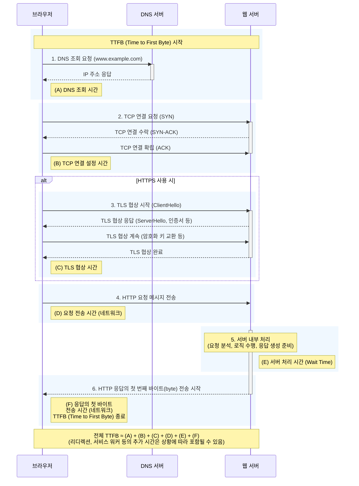
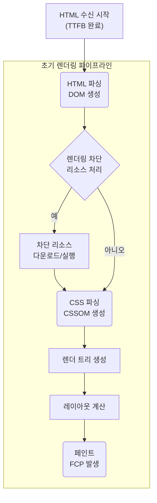
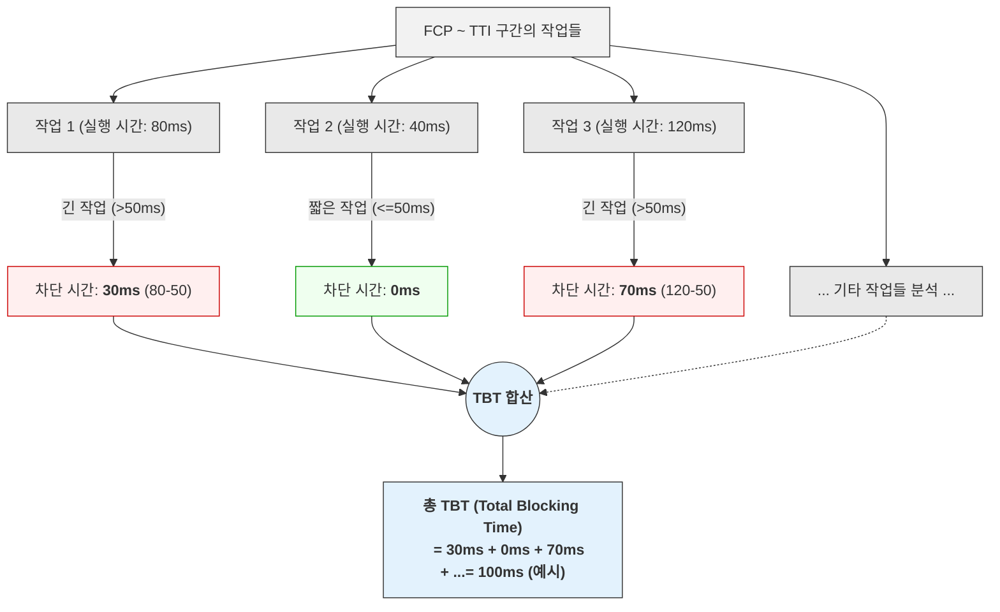

# 2-2. 주요 성능 지표 (TTFB, FCP, TTI 등) 와 그 의미

웹 성능 최적화의 여정은 정확한 측정과 이해에서 시작된다. 앞서 다룬 핵심 웹 지표는 사용자 경험의 핵심적인 측면을 포괄적으로 보여주지만, 때로는 더 세밀한 진단과 분석을 위해 추가적인 성능 지표들을 면밀히 살펴볼 필요가 있다. 이 지표들은 페이지의 생명주기 중 특정 단계에서의 성능을 구체적으로 드러내어, 핵심 웹 지표 점수에 영향을 미치는 근본적인 원인을 파악하고 효과적인 개선 전략을 수립하는 데 중요한 단초를 제공한다. 이 섹션에서는 TTFB, FCP, TTI, TBT, Speed Index와 같이 웹 성능의 다면적인 특성을 이해하는 데 도움을 주는 주요 지표들의 기술적 의미, 측정 방식, 중요성, 그리고 개선 방향에 대해 더욱 상세하게 논의한다.

## 2-2-1. TTFB (Time to First Byte): 서버 응답성의 첫 신호

TTFB (Time to First Byte) 는 브라우저가 서버에 HTTP 요청을 보낸 후, 해당 요청에 대한 응답 데이터의 첫 번째 바이트(byte)를 수신하기까지 소요되는 총 시간을 의미한다. 이는 사용자가 링크를 클릭하거나 주소창에 URL을 입력했을 때부터 브라우저가 서버로부터 유의미한 데이터를 받기 시작하는 바로 그 순간까지의 초기 지연을 나타낸다. 이 시간 동안 사용자는 아무런 시각적 변화 없이 대기하게 되므로, TTFB는 사용자가 인지하는 전체 로딩 시간의 중요한 선행 지표가 된다. 사용자의 첫인상에 영향을 미치며, 이 시간이 길어지면 로딩 과정 전반에 대한 부정적인 인식을 심어줄 수 있다. TTFB는 여러 하위 요소들의 시간 합으로 구성된다. 이 시간이 어떻게 구성되는 지 살펴보자.

먼저 브라우저로 부터 사용자의 요청이 시작되면, 브라우저는 먼저 요청하려는 도메인 이름(예: `www.example.com`)을 실제 서버의 IP 주소로 변환하는 DNS 조회 시간을 거친다. 이 과정은 사용자의 네트워크 설정이나 DNS 서버의 응답 속도에 따라 달라질 수 있다. IP 주소를 확보한 후, 브라우저와 서버 간의 안정적인 데이터 전송 통로를 만들기 위해 TCP 연결 설정 시간(일반적으로 3-way handshake 과정을 통해 SYN, SYN-ACK, ACK 패킷 교환)이 필요하다. 이름에서 알 수 있듯이, 이 절차는 클라이언트와 서버 간에 세 단계에 걸쳐 특정 정보가 담긴 패킷을 교환함으로써 이루어진다.

첫 번째 단계는 클라이언트가 연결 의사를 서버에 전달하는 과정으로, 이때 SYN(Synchronize Sequence Numbers) 패킷이 사용된다. 클라이언트는 서버와의 통신을 시작하기 위해, 앞으로 전송할 데이터의 순서를 관리하는 데 필요한 자신만의 초기 순서 번호(ISN, Initial Sequence Number)를 임의로 생성한다. 이 초기 순서 번호와 함께 TCP 헤더의 SYN 플래그를 '1'로 설정한 SYN 패킷을 서버로 전송한다. 이는 "서버님, 연결을 요청하며, 제가 사용할 데이터의 시작 순서 번호는 X입니다."라는 메시지를 전달하는 역할을 한다. 이 순서 번호는 TCP 통신의 신뢰성을 보장하는 핵심 요소로, 데이터 패킷의 순차적 전송, 누락된 패킷의 재전송 요청, 중복 수신된 패킷의 폐기 등을 가능하게 한다.

그 다음으로는 서버는 클라이언트로부터 이 SYN 패킷을 받으면 연결 요청을 인지하고, 이에 대한 응답이자 자신도 연결할 준비가 되었음을 알리는 SYN-ACK(Synchronize-Acknowledge) 패킷을 클라이언트로 보낸다. 이것이 두 번째 단계이다. 이 패킷은 두 가지 중요한 정보를 담고 있다. 첫째, 서버는 클라이언트가 보낸 초기 순서 번호(X)를 잘 받았다는 확인의 의미로, 해당 번호에 1을 더한 값을 확인 응답 번호(Acknowledgment Number) 필드에 설정한다. 둘째, 서버 역시 데이터 전송에 사용할 자신만의 초기 순서 번호(Y)를 생성하여 패킷에 포함시킨다. 이 패킷의 TCP 헤더에는 SYN 플래그와 ACK 플래그가 모두 '1'로 설정된다. 즉, "클라이언트님, 보내신 순서 번호 X에 대한 요청 잘 받았습니다. 저도 연결할 준비가 되었으며, 제가 사용할 시작 순서 번호는 Y입니다."라는 의미를 전달한다.

마지막 세 번째 단계는 클라이언트가 서버의 SYN-ACK 패킷을 성공적으로 수신했음을 최종적으로 알리는 ACK(Acknowledge) 패킷을 서버로 전송하는 것이다. 클라이언트는 서버가 보낸 초기 순서 번호(Y)를 확인했다는 의미로, 그 번호에 1을 더한 값을 확인 응답 번호 필드에 담아 보낸다. 이 패킷의 TCP 헤더에는 ACK 플래그만 '1'로 설정되며, 일반적으로 이 단계의 ACK 패킷에는 사용자 데이터가 포함되지 않고 순수하게 연결 확립을 위한 확인 메시지만 전달된다. 이는 "서버님, 보내주신 순서 번호 Y에 대한 응답 잘 받았습니다. 이제 연결이 완전히 설정되었습니다."라고 알리는 과정이다.

이처럼 클라이언트의 SYN 전송, 서버의 SYN-ACK 응답, 그리고 클라이언트의 최종 ACK 전송이라는 세 번의 통신이 성공적으로 완료되면, 비로소 클라이언트와 서버 간의 TCP 연결은 '확립됨(Established)' 상태가 된다. 이후 양측은 서로의 순서 번호를 기반으로 데이터를 안정적으로 주고받을 수 있게 된다. 이 전체 3-웨이 핸드셰이크 과정에 소요되는 시간이 바로 TTFB의 'TCP 연결 설정 시간'을 구성하는 핵심이며, 각 패킷이 네트워크를 통해 왕복하는 시간(RTT, Round Trip Time)과 서버의 응답 준비 속도에 직접적인 영향을 받는다. 따라서 네트워크 상태가 불안정하거나 서버의 부하가 높을 경우, 이 연결 설정 단계에서부터 상당한 시간이 지연될 수 있다.

만약 여기에 추가로 HTTPS 프로토콜을 사용하는 경우, TCP 연결 위에 추가적으로 암호화된 통신 세션을 설정하기 위한 TLS 협상 시간(클라이언트와 서버 간 인증서 교환, 암호화 스위트 협상 등)이 소요된다. 이러한 네트워크 연결 설정 단계들이 완료된 후에야 비로소 실제 HTTP 요청 메시지가 서버로 전송될 수 있다.

서버는 이 요청을 수신하여 필요한 처리를 수행한다. 이 서버 처리 시간(Server wait time 또는 Time to Process Request) 은 데이터베이스 조회, 비즈니스 로직 실행, API 호출, 페이지 템플릿 렌더링 등 요청된 콘텐츠를 생성하는 데 필요한 모든 작업을 포함하며, 백엔드 시스템의 효율성을 직접적으로 반영하는 핵심 요소이다. 서버 처리가 완료되고 응답 데이터의 첫 번째 바이트가 생성되어 네트워크를 통해 다시 브라우저에 도달하기까지의 시간을 모두 합쳐 TTFB가 계산된다. 만약 초기 요청이 다른 URL로 리디렉션되는 경우, 해당 리디렉션 처리 시간 또한 TTFB에 포함되어 전체 시간을 증가시킬 수 있다. HTTP/2나 HTTP/3와 같은 최신 프로토콜은 연결 설정 및 요청 처리 방식에서 효율성을 개선하여 TTFB에 긍정적인 영향을 줄 수 있다.

이와 같은 과정을 다이어그램으로 나타내면 다음과 같다.

이 과정에 대해서 간단하게 살펴보자.

1. DNS 조회 (A): 브라우저가 사용자가 입력한 도메인 이름의 IP 주소를 DNS 서버에 요청하고 응답받는 시간이다.
2. TCP 연결 설정 (B): 브라우저와 웹 서버 간에 데이터를 주고받기 위한 TCP 통신 채널을 만드는 과정(3-way handshake)에 소요되는 시간이다.
3. TLS 협상 (C): HTTPS 통신의 경우, TCP 연결 위에 암호화된 세션을 설정하기 위해 클라이언트와 서버가 인증서를 교환하고 암호화 방식을 협상하는 시간이다.
4. 요청 전송 시간 (D): 설정된 연결을 통해 브라우저가 실제 HTTP 요청 메시지(예: GET /index.html)를 웹 서버로 전송하는 데 걸리는 시간이다.
5. 서버 처리 시간 (E): 웹 서버가 수신한 요청을 분석하고, 필요한 비즈니스 로직을 수행하며, 데이터베이스를 조회하는 등 응답 데이터를 생성하여 첫 번째 바이트를 보낼 준비를 마칠 때까지 내부적으로 소요되는 시간입니다. 이것이 순수한 '서버 대기 시간(Wait Time)'에 해당한다.
6. 응답의 첫 바이트 전송 시간 (F): 서버가 생성한 응답의 첫 번째 바이트가 네트워크를 통해 다시 브라우저에 도달하기까지 걸리는 시간이다. 이 시점에 TTFB 측정이 완료된다.

TTFB가 중요한 이유는 이것이 후속하는 모든 프론트엔드 렌더링 성능 지표의 절대적인 시작점을 결정하기 때문이다. 예를 들어, TTFB가 1초 지연되면 사용자가 첫 번째 콘텐츠를 보는 시점(FCP)이나 주요 콘텐츠를 보는 시점(LCP) 역시 최소 1초 이상 지연될 수밖에 없다. 따라서 높은 TTFB 값은 종종 백엔드 시스템의 비효율성(예: 최적화되지 않은 데이터베이스 쿼리 및 스키마, 복잡하고 무거운 비즈니스 로직 수행, 서버 측 코드의 성능 저하, 부족한 서버 하드웨어 자원 – CPU, 메모리, 디스크 I/O 등), 비효율적인 서버 측 캐싱 전략(예: 자주 사용되는 데이터나 페이지 결과물에 대한 캐시 부재 또는 미흡한 관리), 또는 네트워크 지연(예: 사용자와 서버 간의 지리적 거리로 인한 높은 왕복 시간(RTT), 네트워크 혼잡, 사용자의 열악한 로컬 네트워크 환경 – Wi-Fi 신호 약함, 모바일 데이터 속도 저하 등)을 나타내는 강력한 지표가 된다.

TTFB를 개선하기 위해서는 먼저 병목 지점을 정확히 파악해야 한다. 브라우저 개발자 도구의 네트워크 패널이나 WebPageTest와 같은 외부 도구를 사용하여 TTFB의 각 구성 요소(DNS, 연결, TLS, 대기 시간 등)를 분석할 수 있다. 서버 로그 분석, 애플리케이션 성능 모니터링(APM) 도구를 활용한 백엔드 프로파일링은 서버 처리 시간 중 어느 부분에서 지연이 발생하는지(예: 특정 API 응답 지연, 느린 데이터베이스 쿼리 실행 계획) 상세히 확인할 수 있게 해준다. 개선 전략으로는 서버 측 코드 최적화(알고리즘 개선, 불필요한 작업 제거), 데이터베이스 쿼리 튜닝(인덱스 활용, 쿼리 재작성) 및 데이터베이스 서버 자체의 최적화, 효율적인 서버 측 캐싱(예: Opcode 캐시, 객체 캐시 - Memcached, Redis, 페이지 캐시 - Varnish) 구현, 서버 하드웨어 업그레이드, 그리고 지리적으로 분산된 서버를 통해 사용자와 가장 가까운 위치에서 콘텐츠를 제공하는 CDN(Content Delivery Network) 활용하는 방법 등 있다. CDN은 정적 콘텐츠뿐만 아니라 동적 콘텐츠 가속화 기능이나 엣지 컴퓨팅 기능을 제공하여 TTFB 개선에 크게 기여할 수 있으며, 특히 네트워크 왕복 시간(RTT)을 줄이는 데 효과적이다.

## 2-2-2. FCP (First Contentful Paint): 시각적 로딩의 시작점

서버로부터 응답 데이터의 첫 바이트가 도착하면(TTFB 이후), 브라우저는 본격적으로 페이지를 화면에 그리기 위한 준비를 시작한다. 이 과정은 단순히 데이터를 화면에 뿌리는 것을 넘어, 복잡한 내부 처리 단계를 거친다. 브라우저는 수신된 HTML을 파싱하여 문서의 구조를 나타내는 DOM(Document Object Model) 트리를 구축하고, 동시에 CSS를 파싱하여 스타일 정보를 담은 CSSOM(CSS Object Model) 트리를 만든다. 이 두 트리가 완성되면, 브라우저는 이들을 결합하여 화면에 실제로 표시될 요소와 그 스타일 정보를 포함하는 렌더 트리를 생성한다. FCP (First Contentful Paint) 는 사용자가 페이지로 이동을 시작한 시점부터 브라우저가 이 렌더 트리를 기반으로 화면에 첫 번째 DOM 콘텐츠를 렌더링하기까지 걸리는 시간을 측정한다. 여기서 '콘텐츠(Contentful)'는 사용자에게 의미 있는 시각적 정보를 제공하는 모든 요소를 포함하며, 텍스트, 이미지(CSS `background-image` 포함), SVG 그래픽, 또는 흰색이 아닌 내용이 채워진 `<canvas>` 요소 등이 해당된다. 단순한 페이지 배경색이나 비어 있는 `
` 요소의 테두리, 그림자 등은 FCP로 간주되지 않는다. FCP는 브라우저의 렌더링 파이프라인(파싱 → 스타일 계산 → 레이아웃 → 페인트 → 컴포지팅) 중 페인트 단계에서 유의미한 첫 번째 결과물이 나오는 시점이다.

1. A (HTML 수신 시작 - TTFB 완료): 서버 응답(TTFB) 후, 브라우저가 HTML 데이터를 받기 시작한다.
2. B (HTML 파싱 - DOM 생성): 브라우저가 HTML 코드를 읽어 페이지의 뼈대인 DOM(Document Object Model)을 만든다.
3. D (렌더링 차단 리소스 처리?): 화면 그리기를 막는 요소(CSS, 자바스크립트 등)가 있는지 확인하고 처리한다.
4. E (차단 리소스 다운로드/실행): 만약 화면 그리기를 막는 파일(주로 CSS나 특정 자바스크립트)이 있다면, 이를 먼저 다운로드하고 실행한다. 이 과정은 FCP를 늦출 수 있다.
5. F (CSS 파싱 - CSSOM 생성): 브라우저가 CSS 코드를 읽어 페이지의 스타일 정보인 CSSOM(CSS Object Model)을 만든다.
6. G (렌더 트리 생성): 만들어진 DOM과 CSSOM을 합쳐 화면에 실제로 보일 요소들로 구성된 렌더 트리를 만든다.
7. H (레이아웃 계산): 렌더 트리의 각 요소들이 화면 어디에 어떤 크기로 보일지 위치와 크기를 계산한다.
8. I (페인트 - FCP 발생): 계산된 정보를 바탕으로 화면에 실제 픽셀을 그린다. 이때 처음으로 의미 있는 내용(글자, 이미지 등)이 그려지는 순간이 FCP이다.

'초기 렌더링 파이프라인' 그래프는 HTML/CSS 파싱부터 레이아웃 및 첫 페인트까지, FCP에 직접적으로 관여하는 핵심 단계들을 나타낸다. 이 파이프라인의 효율성을 높이는 것, 특히 렌더링 차단 리소스를 줄이는 것이 FCP를 개선하는 핵심이다.

FCP는 사용자 경험 측면에서 매우 중요한 의미를 지닌다. 사용자가 링크를 클릭한 후 마주하는 빈 화면 상태는 불확실성과 지루함을 유발하여 이탈률을 높일 수 있다. FCP는 이 빈 화면 상태가 끝나고 페이지가 실제로 로드되고 있다는 첫 번째 구체적인 시각적 피드백을 제공하는 시점이다. 이 순간 사용자는 '아, 제대로 로딩되고 있구나'라고 인지하며 심리적인 안정감을 느끼고, 페이지가 완전히 로드될 때까지 기다릴 가능성이 높아진다. FCP가 빠를수록 사용자는 페이지가 즉각적으로 반응한다고 느끼게 된다.

FCP는 TTFB 시간에 직접적인 영향을 받지만, TTFB가 빠르다고 해서 FCP가 반드시 빠른 것은 아니다. FCP 지연의 주된 원인은 프론트엔드, 특히 렌더링 차단 리소스(Render-Blocking Resources) 에 있다. 브라우저는 HTML 문서를 위에서 아래로 순차적으로 파싱하다가 `<head>` 태그 내부에 있는 외부 CSS 파일(`<link rel="stylesheet" href="...">`)을 만나면, 해당 CSS 파일 전체를 다운로드하고 파싱하여 CSSOM을 구축하기 전까지는 렌더 트리 생성을 완료할 수 없으므로 렌더링을 중단한다. 마찬가지로, `async` 또는 `defer` 속성이 없이 `<head>` 태그 안에 위치한 동기적으로 실행되는 자바스크립트 파일(``)을 만나면, 해당 스크립트의 다운로드, 파싱, 실행이 완료될 때까지 DOM 구축 및 후속 렌더링 과정을 일시 중단한다. 이는 스크립트가 DOM 구조를 변경할 가능성이 있기 때문이다. 이러한 렌더링 차단 리소스가 많거나 그 크기가 크면, 브라우저는 화면에 아무것도 그리지 못한 채 대기하게 되어 FCP가 현저히 늦어진다. CSS 내부의 `@import` 규칙 또한 추가적인 렌더링 차단을 유발할 수 있으므로 사용에 주의해야 한다. 또한, 웹 폰트 로딩 방식도 FCP에 영향을 미칠 수 있다. 폰트 파일이 다운로드되어 적용되기 전까지 텍스트 렌더링이 지연되거나(FOIT - Flash of Invisible Text), 기본 시스템 폰트로 먼저 표시되었다가 웹 폰트가 적용되면서 글꼴이 바뀌는 현상(FOUT - Flash of Unstyled Text)은 사용자가 인지하는 첫 번째 콘텐츠 표시 시점을 혼란스럽게 만들고 FCP 측정에 영향을 줄 수 있다.

FCP를 개선하기 위해서는 TTFB를 단축하는 기본적인 노력과 더불어, 렌더링 차단 리소스의 영향을 최소화하는 것이 핵심이다. CSS의 경우, 초기 화면 렌더링(특히 above-the-fold 영역)에 필수적인 스타일(Critical CSS)은 HTML 문서 내에 `<style>` 태그를 사용하여 인라인(inline)으로 포함시키고, 나머지 스타일(예: 스크롤해야 보이는 영역의 스타일, 인터랙션에 사용되는 스타일 등)은 비동기적으로 로드하거나 페이지 하단에서 로드하는 전략을 사용할 수 있다. 자바스크립트의 경우, 꼭 필요한 경우가 아니라면 `<head>`에서의 동기적 로드를 피하고, `async` 속성(DOM 파싱과 병행하여 다운로드 및 실행)이나 `defer` 속성(DOM 파싱과 병행하여 다운로드 후, DOM 파싱이 완료된 시점에 실행)을 사용하여 DOM 구축을 차단하지 않도록 하거나, DOM 생성이 완료된 후 실행되도록 문서 하단(`</body>` 태그 직전)으로 옮기는 것이 좋다. 웹 폰트는 `font-display` CSS 속성(예: `swap`, `optional`)을 적절히 사용하여 텍스트가 최대한 빨리 보이도록 하고, WOFF2와 같은 최신 압축 포맷을 사용하며, 필요한 글리프(glyph)만 포함하는 서브셋 폰트를 사용하거나, 시스템 폰트를 우선적으로 활용하는 방안(font stack)도 고려할 수 있다. 리소스 힌트(`preload`, `preconnect`, `dns-prefetch`)를 사용하여 중요한 리소스의 다운로드를 미리 시작하거나 연결 설정을 최적화하는 것도 간접적으로 FCP 개선에 도움을 줄 수 있다.

## 2-2-3. TTI (Time to Interactive): 진정한 사용 가능 시점

페이지에 콘텐츠가 표시되기 시작하고(FCP), 주요 콘텐츠가 화면에 나타났다고(LCP) 해서 사용자가 즉시 페이지와 원활하게 상호작용할 수 있는 것은 아니다. 최신 웹 애플리케이션은 풍부한 사용자 경험을 제공하기 위해 많은 양의 자바스크립트를 사용하며, 이러한 자바스크립트 코드는 페이지의 초기 렌더링 이후에도 계속해서 실행되어 이벤트 핸들러를 등록하고, 동적 콘텐츠를 로드하며, UI 컴포넌트를 초기화하는 등의 작업을 수행한다. 이 과정에서 브라우저의 메인 스레드가 과도하게 바빠지면, 사용자의 입력(클릭, 스크롤, 키 입력 등)에 대한 처리가 지연되어 페이지가 먹통이 된 것 처럼 느껴질 수 있다. TTI (Time to Interactive) 는 페이지가 시각적으로 의미 있게 렌더링되었을 뿐만 아니라, 사용자 입력에 안정적으로 그리고 신속하게 반응할 수 있는, 즉 '완전히 상호작용 가능한' 상태가 되기까지 소요되는 시간을 측정하는 지표이다. 이 TTI 가 달성되는 과정을 다이어그램으로 나타내면 다음과 같다.

```mermaid
gantt
    dateFormat  X
    title TTI 달성 과정과 메인 스레드 상태
    axisFormat %Lms

    section 페이지 로드
    FCP 발생          :fcp, 0, 100
    메인 스레드 작업   : 100, 1500
    긴 작업 (JS 실행) :crit, task1, 300, 250
    메인 스레드 작업   : 1600, 800
    긴 작업 (JS 실행) :crit, task2, 1800, 300

    section 유휴 상태 및 TTI
    네트워크/메인 스레드 유휴 (x초) :milestone, idleStart, 2400, 0
    TTI 달성 :milestone, tti, 7400, 0
```

1. FCP 발생: 페이지 로딩이 시작되고 첫 번째 콘텐츠가 그려지는 시점
2. 메인 스레드 작업 시작 및 진행: FCP 이후 메인 스레드가 자바스크립트 실행, DOM 변경, 스타일 계산 등 다양한 작업을 수행
3. 긴 작업 1 & 2 발생: 이 기간 동안 50ms를 초과하는 '긴 작업'들이 발생하여 메인 스레드를 점유하고, 이는 페이지의 반응성을 저해할 수 있다.
4. 모든 주요 스크립트 실행 완료: 초기 로딩에 필요한 주요 자바스크립트 작업들이 마무리되는 시점이다.
5. 네트워크 및 메인 스레드 유휴 상태 시작 (Quiet Window): 메인 스레드가 더 이상 바쁘지 않고, 네트워크 요청도 거의 없는 '조용한' 상태로 접어든다.
6. 5초간 유휴 상태 유지: 이 조용한 상태가 5초 동안 지속되면 (즉, 새로운 긴 작업이 발생하지 않으면) 브라우저는 페이지가 완전히 상호작용 가능하다고 판단한다.
7. TTI 달성: 위의 조건이 충족되어 페이지가 완전히 상호작용 가능해진 시점

TTI는 페이지의 사용성을 실질적으로 판단하는 중요한 기준으로, '보이는 것'과 '실제 작동하는 것' 사이의 잠재적 간극을 명확히 보여준다. 기술적으로 TTI는 다음 세 가지 조건을 모두 만족하는 가장 이른 시점으로 정의된다.

- 첫째, 페이지에 최소한 FCP(First Contentful Paint)가 발생하여 의미 있는 콘텐츠가 표시되어야 한다.
- 둘째, 페이지 내에서 가장 눈에 띄고 자주 사용될 것으로 예상되는 인터랙티브 요소들에 대한 이벤트 핸들러가 등록되어 있어야 한다(즉, 사용자의 액션에 반응할 코드가 준비되어야 한다).
- 셋째, 페이지가 사용자의 입력에 50ms 이내에 응답할 수 있어야 한다. 이는 일반적으로 메인 스레드가 최소 5초 동안 50ms를 초과하는 '긴 작업(Long Task)' 없이 조용한(idle) 상태를 유지할 때 달성된 것으로 간주된다. 50ms라는 기준은 사용자가 인터랙션 후 100ms 이내에 시각적 피드백을 받지 못하면 지연을 인지하기 시작한다는 연구 결과에 기반하며, 50ms 이상의 작업은 이러한 즉각적인 피드백을 방해할 수 있는 잠재적 요인으로 본다. 5초라는 '조용한 기간'은 일시적인 유휴 상태가 아니라 지속적으로 상호작용할 준비가 되었음을 확인하기 위함이며, 이 기간 동안 발생하는 작은 작업들은 TTI 달성을 방해하지 않을 수 있다(일반적으로 네트워크 요청 2개 이하).

TTI는 특히 자바스크립트 프레임워크나 라이브러리(React, Angular, Vue 등)를 사용하여 구축된 SPA(Single Page Application)에서 그 중요성이 더욱 부각된다. 이러한 애플리케이션들은 초기 로딩 시 비교적 큰 자바스크립트 번들을 다운로드하고 실행하여 전체 UI를 클라이언트 측에서 렌더링하는 경우가 많다. 이 과정에서 메인 스레드는 스크립트 파싱, 컴파일, 실행, 컴포넌트 초기화 및 렌더링, 이벤트 핸들러 부착 등 다양한 작업을 수행한다. 화면은 빠르게 그려질 수 있지만, 이러한 백그라운드 작업이 완료되어 TTI에 도달하기까지의 시간은 상당히 길어질 수 있으며, 이는 사용자에게 혼란과 불편을 초래한다. 예를 들어, 버튼이 화면에 보이지만 클릭해도 아무런 반응이 없거나, 스크롤이 부드럽지 못하고 끊기는 현상이 발생할 수 있다.

TTI를 개선하기 위해서는 초기 로딩 시 메인 스레드에서 실행되는 자바스크립트의 양을 줄이고 실행 효율을 높이는 것이 핵심이다. 구체적인 전략으로는 코드 분할(Code Splitting) 이 대표적이다. 이는 하나의 거대한 자바스크립트 번들 파일을 여러 개의 작은 청크(chunk)로 나누어, 초기에는 현재 페이지 렌더링에 필수적인 코드만 로드하고, 사용자의 특정 행동이나 라우트 이동 시점에 필요한 코드를 동적으로 로드하는 방식이다. 트리 쉐이킹(Tree Shaking) 은 빌드 과정에서 실제로 사용되지 않는 코드를 자바스크립트 번들에서 제거하여 전체 크기를 줄이는 기법이다. 또한, 초기 렌더링에 필요하지 않은 서드파티 스크립트(분석 도구, 광고, 소셜 미디어 위젯 등)는 TTI 달성 이후로 로딩을 지연시키거나 비동기적으로 로드하는 것이 좋다. 계산 집약적이거나 시간이 오래 걸리는 작업은 웹 워커(Web Workers) 를 활용하여 메인 스레드가 아닌 별도의 백그라운드 스레드에서 처리함으로써 메인 스레드의 부담을 줄일 수 있다. 긴 자바스크립트 작업들을 여러 개의 작은 작업으로 분할하여 각 작업 사이에 브라우저가 사용자 입력에 반응할 수 있는 기회를 제공하는 것(예: `setTimeout`이나 `requestIdleCallback`을 이용한 스케줄링)도 중요한 최적화 기법이다. 프레임워크를 사용하는 경우, 서버 사이드 렌더링(SSR) 후 클라이언트 사이드에서 상호작용을 활성화하는 과정인 하이드레이션(hydration)을 점진적으로 수행하는 프로그레시브 하이드레이션(Progressive Hydration) 과 같은 고급 기법도 TTI 개선에 도움이 될 수 있다.

## 2-2-4. TBT (Total Blocking Time): 메인 스레드 부하의 정량적 지표

TTI가 페이지가 언제부터 상호작용 가능해지는지를 알려주는 '결과' 지표라면, TBT (Total Blocking Time) 는 그 결과에 이르기까지 메인 스레드가 얼마나 심하게 '차단(block)'되었는지를 정량적으로 보여주는 '과정' 지표이다. TBT는 FCP(First Contentful Paint)와 TTI(Time to Interactive) 사이의 시간 구간에서 발생한 모든 '긴 작업(Long Task, 50ms를 초과하여 실행되는 작업)'들의 '차단 시간(blocking portion)'을 합산하여 계산한다. 여기서 '차단 시간'이란 각 긴 작업의 총 실행 시간에서 50ms를 뺀 시간을 의미한다. 예를 들어, 메인 스레드에서 120ms 동안 실행된 작업이 있다면, 이 작업의 차단 시간은 70ms(120ms - 50ms)로 계산된다. TBT는 이러한 차단 시간들을 모두 더한 값이다. 만약 FCP와 TTI 사이에 긴 작업이 없다면 TBT는 0이 된다.

TBT는 메인 스레드가 자바스크립트 실행, 스타일 계산, 레이아웃, 페인트 등과 같은 작업에 얼마나 오랫동안 집중하느라 사용자 입력 처리와 같은 다른 중요한 작업을 수행하지 못했는지를 나타낸다. 웹 브라우저의 메인 스레드는 한 번에 하나의 작업만 처리할 수 있는 싱글 스레드 환경에서 작동한다. 따라서 긴 작업이 메인 스레드를 점유하고 있는 동안에는 사용자가 버튼을 클릭하거나 스크롤을 해도 브라우저는 이를 즉시 감지하거나 처리할 수 없게 되어, 사용자는 인터페이스가 멈추거나 버벅거리는 현상을 경험하게 된다. TBT는 바로 이러한 응답 불가능 시간의 총량을 보여주는 것이다. TBT가 높다는 것은 로딩 과정에서 메인 스레드가 자주 그리고 오랫동안 사용자 입력에 반응할 수 없는 상태였다는 의미이므로, 사용자가 느린 상호작용성을 경험했을 가능성이 높음을 시사한다.

TBT는 주로 Lighthouse와 같은 성능 측정 도구를 통해 실험실 환경에서 측정되며, 실제 사용자 환경에서의 상호작용성 관련 지표(예: INP - Interaction to Next Paint)와 높은 상관관계를 가진다. 즉, TBT 수치가 높다는 것은 메인 스레드가 과도한 작업 부하로 인해 자주 차단되었음을 의미하며, 이는 실제 사용자가 페이지와 상호작용할 때 느린 반응성을 경험할 가능성이 크다는 강력한 경고 신호이다. TBT를 줄이는 것은 메인 스레드의 부담을 경감시켜 페이지의 전반적인 반응성을 향상시키는 데 필수적이다. 이를 위해서는 TTI 개선 전략과 마찬가지로, 긴 자바스크립트 작업을 더 작은 단위의 작업으로 분해하여 메인 스레드가 중간중간 숨을 돌릴 수 있도록 하고(예: `setTimeout`, `requestIdleCallback` 활용), 웹 워커를 사용하여 계산 집약적인 작업을 백그라운드 스레드로 옮기며, 알고리즘 및 코드 자체의 실행 효율성을 높이는 노력이 필요하다. 브라우저 개발자 도구의 Performance 패널을 사용하면 긴 작업을 식별하고 어떤 함수나 코드가 많은 시간을 소요하는지 프로파일링할 수 있어 TBT 개선에 실질적인 도움을 준다.

## 2-2-5. SI (Speed Index): 시각적 로딩 속도의 체감 지표

FCP나 LCP와 같은 지표들이 페이지 로딩 과정 중 특정 '시점'에 특정 요소가 렌더링되었는지 여부를 측정한다면, SI (Speed Index) 는 페이지 로딩 과정 '전체'에 걸쳐 사용자 뷰포트 내의 콘텐츠가 시각적으로 얼마나 빠르게 채워지는지를 평가하는 지표이다. 이는 단일 이벤트의 완료 시점이 아니라, 로딩 과정 동안 화면이 점진적으로 완성되어 가는 속도 자체를 정량화하여 보여준다. SI는 사용자가 얼마나 빨리 콘텐츠를 인지하고 페이지가 사용 가능하다고 느끼는지에 대한 중요한 단서를 제공한다.

SI는 페이지 로딩 과정을 비디오 프레임 단위로 분석하여 계산된다. 각 프레임에서 현재 화면에 표시된 콘텐츠가 최종적으로 렌더링된 상태와 시각적으로 얼마나 유사한지를 비교하고(주로 픽셀 단위 비교 또는 구조적 유사성 비교 알고리즘(SSIM - Structural Similarity Index Measure)과 같은 고급 기법 사용), 시간 경과에 따른 이 시각적 완성도의 변화를 종합하여 하나의 점수로 산출한다. SI 점수는 낮을수록 로딩 과정 초기에 더 많은 콘텐츠가 빠르게 표시되어 사용자가 체감하는 로딩 속도가 빠르다는 것을 의미한다. 예를 들어, 두 페이지의 LCP 달성 시간이 동일하더라도, 초기부터 콘텐츠가 꾸준하고 빠르게 나타나는 페이지가 마지막 순간에 갑자기 모든 콘텐츠가 한꺼번에 나타나는 페이지보다 더 낮은(좋은) SI 점수를 받게 된다. 이는 사용자가 빈 화면을 보는 시간이 짧고, 점진적으로 채워지는 화면을 통해 로딩 진행 상황을 인지할 수 있기 때문이다.

SI는 특히 사용자가 처음 페이지를 열었을 때 스크롤 없이 바로 보게 되는 영역, 즉 'above-the-fold' 영역의 콘텐츠가 얼마나 신속하게 사용자에게 표시되는지에 민감하게 반응한다. 이 초기 화면 영역의 시각적 완성 속도는 사용자의 첫인상과 초기 이탈률에 큰 영향을 미칠 수 있기 때문에 SI는 이러한 측면을 평가하는 데 유용하다. 플레이스홀더(placeholder) 이미지나 스켈레톤 스크린(skeleton screen)과 같은 UI 패턴은 실제 콘텐츠가 로드되기 전에 페이지의 구조를 미리 보여줌으로써 사용자가 느끼는 로딩 시간을 줄이고 SI 점수를 개선하는 데 도움을 줄 수 있다. SI는 주로 Lighthouse와 같은 실험실 환경에서 측정되며, 서로 다른 페이지 디자인 버전이나 다양한 최적화 전략이 시각적 로딩 속도에 미치는 영향을 비교 분석하거나, 성능 개선 작업의 효과를 정량적으로 평가하는 데 활용된다. SI를 개선하기 위해서는 크리티컬 렌더링 경로(Critical Rendering Path)를 최적화하고, above-the-fold 영역에 필요한 CSS, 웹 폰트, 주요 이미지 등의 리소스를 효율적으로 우선 로드하며, 서버 응답 시간을 단축하는 등의 전략이 중요하다. 이미지 포맷(AVIF, WebP 등) 최적화 및 적절한 압축, 그리고 서버 사이드 렌더링(SSR)이나 정적 사이트 생성(SSG)을 통해 초기 HTML 콘텐츠를 빠르게 전달하는 것도 SI 개선에 기여할 수 있다.

## 2-2-6. 마치며

지금까지 살펴본 TTFB, FCP, TTI, TBT, Speed Index는 핵심 웹 지표와 함께 웹 성능의 다양한 측면을 입체적으로 이해하는 데 필수적인 지표들이다. 각 지표는 페이지 요청부터 초기 렌더링, 상호작용 가능 상태에 이르기까지의 복잡한 과정 속에서 발생할 수 있는 다양한 성능 병목 현상을 구체적으로 식별하는 데 도움을 준다. 어느 한 지표에만 집중하기보다는, 이 지표들을 종합적으로 분석하여 상호 연관성을 파악하고 문제의 근본 원인을 찾아내는 것이 중요하다. 예를 들어, 높은 TTFB는 필연적으로 FCP와 LCP의 지연으로 이어지며, 과도한 자바스크립트 실행은 TTI와 TBT를 악화시켜 사용자가 느끼는 전반적인 인터랙션 품질(예: INP)에 부정적인 영향을 미칠 수 있다. Speed Index는 이러한 과정 전체의 시각적 흐름과 완성도를 보여주어 사용자의 체감 속도에 대한 추가적인 통찰을 제공한다.

개발자는 이러한 지표들의 기술적인 의미를 정확히 이해하고, 브라우저 개발자 도구나 다양한 성능 측정 서비스를 통해 얻은 측정값을 면밀히 분석함으로써, 백엔드 시스템의 응답성, 네트워크 효율성, 프론트엔드 리소스 로딩 방식, 자바스크립트 코드 실행 효율 등 문제의 원인이 되는 영역을 정확히 특정할 수 있다. 이를 바탕으로 데이터에 기반한 효과적인 최적화 전략을 수립하고 그 효과를 검증하는 반복적인 과정을 통해 지속적인 성능 개선을 추구해야 한다. 궁극적으로 이러한 노력은 단순히 숫자를 개선하는 것을 넘어, 사용자에게 더 빠르고 안정적이며 만족스러운 웹 경험을 제공하는 것으로 귀결될 것이며, 이는 서비스의 성공과도 직결되는 중요한 요소이다.
